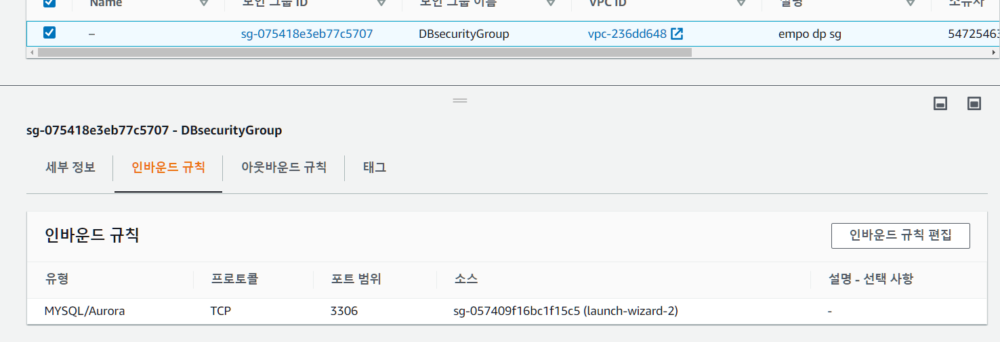
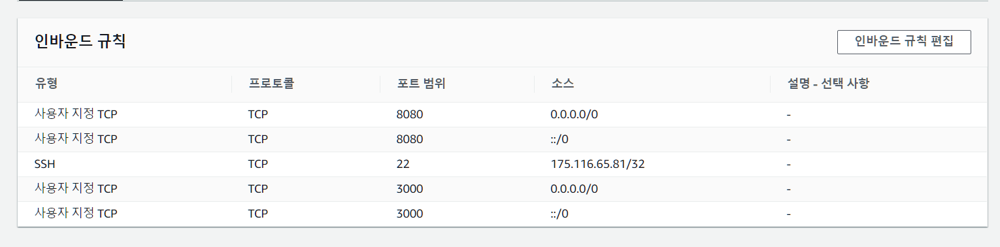
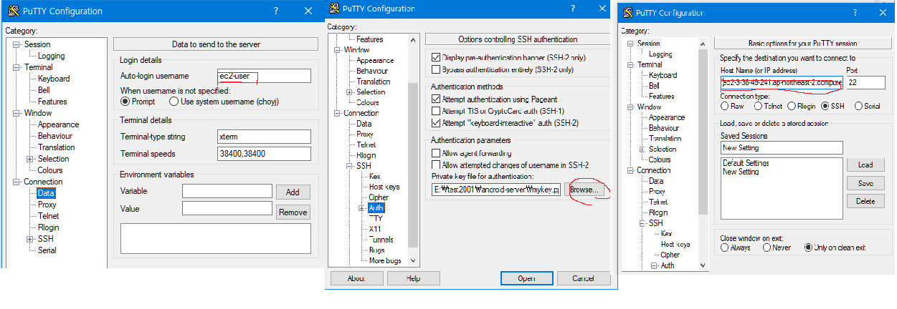
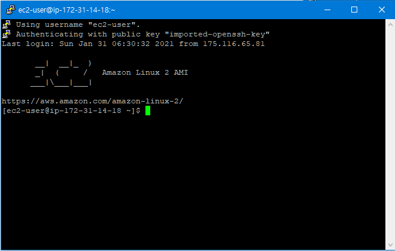
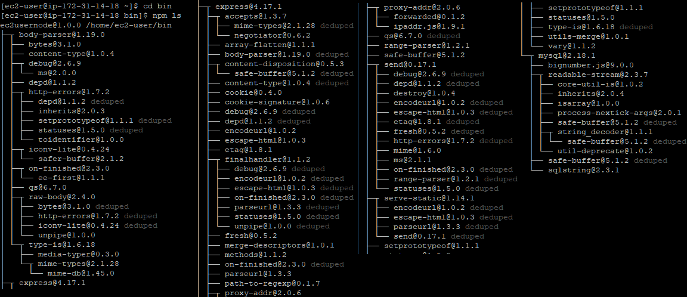
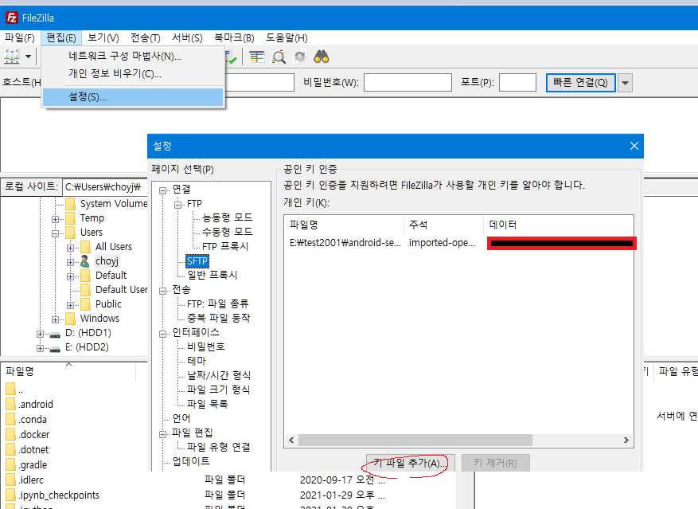
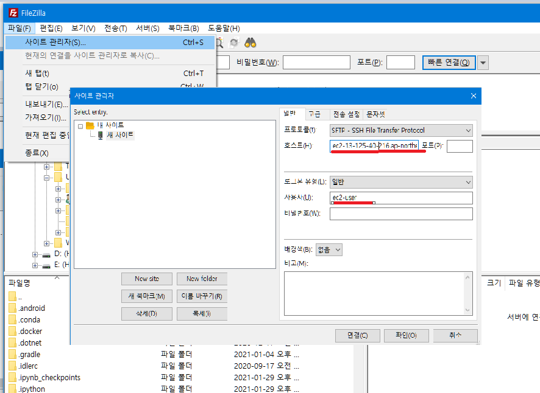
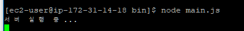

# AWS(EC2+RDS) +NODE.js + mysql로 로그인/ 회원 가입/ 친구창

- ### 간단한 연습

  - 기간: 2021.1.27~21.1.31
  - 언어: node.js , kotlin,  mysql
  - 실행환경 : android 
  - Tools: android studio, putty, mysql, filezilla,aws
  - **설명**: 이전에 했던 실습처럼 사용자 기기가 모든 데이터를 가져와서 작업하는 것이 아닌 서버가 기기에서 필요한 정보만 걸러서 제공하는 서버를 가진 프로그램을 구상하던 중 서버 구성에 대한 이해를 위해 실습


- 회원가입 / 로그인

  

- 로그인/ 친구창

  


### 과정

1. AWS RDS를  구성 (인바운드 구성 : 작업 능률성을 위한 mysql workbench 3306 포트, 추후 구성한 ec2의 보안그룹을 인바운드 규칙에 추가 )

2. AWS EC2 를 구성- linux 환경 ( 인바운드 구성 :  putty가 ec2에 접근을 위한 22포트를 작업할 ip주소로 추가, 안드로이드 기기에서 접근할 사용자 지정 TCP 3000포트(node.js포트)로  추가 )

3. putty설치 putty gen로 ec2의 키를 ppk 로 컨버트 후 puuty구성 (ec2 hostname, username, key)
   
   정상 실행 화면
   

   
   
   
4. putty 설정 실행후  - putty 명령어 창에  node.js 설치 &  필요한 라이브러리 설치 ( 추가적으로 3., 4. aws ec2에서 제공하는 인스턴스 접속기능으로도 수행 가능)

   ```
   wget https://nodejs.org/dist/v10.10.0/node-v10.10.0-linux-x64.tar.xz
   tar xvf node-v10.10.0-linux-x64.tar.xz
   mv node-v10.10.0-linux-x64 nodejs
   mkdir bin
   cp nodejs/bin/node bin
   cd bin
   ln -s ../nodejs/lib/node_modules/npm/bin/npm-cli.js npm
   
   npm init
   npm install mysql --save
   npm install express --save
   npm install body-parser --save
   ```

   제대로 설치가 되었는지 확인

   ```
   cd bin
   npm ls
   ```

   

5. 서버 구성  - 사용자 기기에 요청에 따라 db에 쿼리를 묻고 받아올 수있게 구성 

   ```js
   // main.js
   var mysql = require('mysql');
   var express = require('express');
   var bodyParser = require('body-parser');
   var app = express();
   
   app.use(bodyParser.json());
   app.use(bodyParser.urlencoded({extended: true}));
   
   app.listen(3000, '0.0.0.0', function () {
       console.log('서버 실행 중...');
   });
   
   var connection = mysql.createConnection({
       host: "db 엔드포인트",
       user: "db 사용자 계정",
       database: "db 스키마 명",
       password: "db 사용자 비밀번호",
       port: 3306
   });
   
   app.post('/user/join', function (req, res) {
       console.log(req.body);
       var userEmail = req.body.userEmail;
       var userPwd = req.body.userPwd;
       var userName = req.body.userName;
   
       // 삽입을 수행하는 sql문.
       var sql = 'INSERT INTO Users (UserEmail, UserPwd, UserName) VALUES (?, ?, ?)';
       var params = [userEmail, userPwd, userName];
   
       // sql 문의 ?는 두번째 매개변수로 넘겨진 params의 값으로 치환된다.
       connection.query(sql, params, function (err, result) {
           var resultCode = 404;
           var message = '에러가 발생했습니다';
   
           if (err) {
               console.log(err);
           } else {
               resultCode = 200;
               message = '회원가입에 성공했습니다.';
           }
   
           res.json({
               'code': resultCode,
               'message': message
           });
       });
   });
   
   app.post('/user/login', function (req, res) {
       var userEmail = req.body.userEmail;
       var userPwd = req.body.userPwd;
       var sql = 'select * from Users where UserEmail = ?';
       
   
       connection.query(sql,userEmail, function (err, result) {
           var resultCode = 404;
           var message = '에러가 발생했습니다';
           var uid =null
   
           if (err) {
               console.log(err);
           } else {
               if (result.length === 0) {
                   resultCode = 204;
                   message = '존재하지 않는 계정입니다!';
               } else if (userPwd !== result[0].UserPwd) {
                   resultCode = 204;
                   message = '비밀번호가 틀렸습니다!';
               } else {
                   resultCode = 200;
                   message = '로그인 성공! ' + result[0].UserName + '님 환영합니다!';
                   userId=result[0].UserID
               }
           }
   
           res.json({
               'code': resultCode,
               'message': message,
               'userId' : userId
           });
       })
   });
   
   app.post('/user/friends',function(req,res){
       var useruid = req.body.useruid;
       console.log(useruid+'친구리스트...');
   
       var sql = 'select User1Uid,User1Name,User2Uid,User2Name from FriendsList where User1Uid=? or User2Uid=?';
   
       connection.query(sql,[useruid,useruid], function (err, result) {
           var resultCode = 404;
           var message = '에러가 발생했습니다';
           
           if (err) {
               console.log(err);
           } else {
               if (result.length === 0) {
                   resultCode = 204;
                   message = '칭구가 없습니다...';
               } else {
                   resultCode = 200;
                   message = '칭구 ' + result.length + '명 발견';
               }
           }
   
           res.json({
               'code': resultCode,
               'message': message,
               'userlist' : result
           });
       })
   
   });
   ```

   

6. filezilla 구성  , ec2의 bin folder 에 main.js 를 넣고 main.js실행

   - filezilla 연결  ppk-키 삽입, 사이트 관리자 
     
     
     
     
   - 연결후 bin 폴더안에 js파일을 넣고

7. putty 커맨드에서  실행

   ```
   cd bin
   node main.js
   ```

   

8. 안드로이드스튜디오에서 Retrofit을 이용해 구성

   ```kotlin
   import retrofit2.Retrofit
   import retrofit2.converter.gson.GsonConverterFactory
   
   
   object RetrofitClient {
       private const val BASE_URL = "http://ec2-3-36-49-241.ap-northeast-2.compute.amazonaws.com:3000"
       private var retrofit: Retrofit? = null
       val client: Retrofit
           get() {
               while (retrofit == null) {
                   retrofit= Retrofit.Builder().baseUrl(BASE_URL) .addConverterFactory(GsonConverterFactory.create()).build();
   
               }
   
               return retrofit!!
           }
   }
   ```

   


9. 연결에 필요한  interface, 각 데이터, 응답 클래스 선언

   ```kotlin
   // js 파일의  구성과 같게 interface 선언
   interface ServiceApi {
       @POST("/user/login")
       fun userLogin(@Body data: LoginData?): Call<LoginResponse?>?
   
       @POST("/user/join")
       fun userJoin(@Body data: JoinData?): Call<JoinResponse?>?
   
       @POST("/user/friends")
       fun findFriend(@Body data: UserData): Call<FriendlistResponse?>?
   }
   
   
   // 회원가입 post의 입력 데이터
   data class JoinData(
       @field:SerializedName("userName") private val userName: String,
       @field:SerializedName("userEmail") private val userEmail: String,
       @field:SerializedName("userPwd") private val userPwd: String
   )
   class JoinResponse { // 회원가입 post의 응답데이터
       @SerializedName("code")
       val code = 0
   
       @SerializedName("message")
       val message: String? = null
   }
   
   
   
   // 친구리스트 입력데이터
   data class UserData(
           @field:SerializedName("useruid") private val useruid: Int
   )
   class  friendrelation( // 배열 템플릿
           @field:SerializedName("User1Uid")  val user1uid: Int,
           @field:SerializedName("User1Name")  val user1name: String,
           @field:SerializedName("User2Uid")  val user2uid: Int,
           @field:SerializedName("User2Name")  val user2name: String
   )
   //친구리스트 응답데이터
   class FriendlistResponse {// 추가적으로 응답 데이터가 배열을 포함하는 경우에도 그냥 문법에 맞게 구성
       @SerializedName("code")
       val code = 0
   
       @SerializedName("message")
       val message: String? = null
   
       @SerializedName("userlist")
       val userlist : Array<friendrelation>? =null
   
   }
   ```

10.  액티비티 내에서 데이터 입출력을 위한 코드 작성

    ```kotlin
    //Activity 생성시에 retrofit client 구성 
    override fun onCreate(savedInstanceState: Bundle?) {      
        	//-----------------------------------------------------        
        	val retrofit = RetrofitClient.client 
            service = retrofit.create(ServiceApi::class.java);
        	//-----------------------------------------------------
        }
    
    // 값을 불러 오는 함수에 포함되어야 할 내용
    service!!.userJoin(data)!!.enqueue(object : Callback<JoinResponse?> {
                override fun onResponse(  // 값을 정상적으로 불러 왔을 경우
                    call: Call<JoinResponse?>,
                    response: Response<JoinResponse?>
                ) {
                    val result = response.body() // 응답 데이터를 받아올 변수 
                    							// result.code , result.message 처럼 응답 데이터로 구성한 클래스에 따라 사용
                    Toast.makeText(JoinActivity.joincontext, result!!.message, Toast.LENGTH_SHORT).show() // 단순 토스트 메시지
                    showProgress(false)
                    if (result.code == 200) {// 회원 가입 성공 시 joinactivity 종료
                        finish() 	 
                    }
                }
    
                override fun onFailure( //에러 발생
                    call: Call<JoinResponse?>,
                    t: Throwable
                ) {
                    Toast.makeText(JoinActivity.joincontext, "회원가입 에러 발생", Toast.LENGTH_SHORT).show()// 단순 토스트 메시지
                    Log.e("회원가입 에러 발생", t.message!!) 
                    showProgress(false)			
                }
            })
    
    
    // 
    ```

    


- db구성
  - User db
  
  
  
  
  
  - FriendsList
  
  
  

